# Projects and dependencies analysis

This document provides a comprehensive overview of the projects and their dependencies in the context of upgrading to .NETCoreApp,Version=v10.0.

## Table of Contents

- [Executive Summary](#executive-Summary)
  - [Highlevel Metrics](#highlevel-metrics)
  - [Projects Compatibility](#projects-compatibility)
  - [Package Compatibility](#package-compatibility)
  - [API Compatibility](#api-compatibility)
- [Aggregate NuGet packages details](#aggregate-nuget-packages-details)
- [Top API Migration Challenges](#top-api-migration-challenges)
  - [Technologies and Features](#technologies-and-features)
  - [Most Frequent API Issues](#most-frequent-api-issues)
- [Projects Relationship Graph](#projects-relationship-graph)
- [Project Details](#project-details)

  - [benchmarks\VertexBPMN.Benchmarks\VertexBPMN.Benchmarks.csproj](#benchmarksvertexbpmnbenchmarksvertexbpmnbenchmarkscsproj)
  - [src\VertexBPMN.Api\VertexBPMN.Api.csproj](#srcvertexbpmnapivertexbpmnapicsproj)
  - [src\VertexBPMN.Application\VertexBPMN.Application.csproj](#srcvertexbpmnapplicationvertexbpmnapplicationcsproj)
  - [src\VertexBPMN.Domain\VertexBPMN.Domain.csproj](#srcvertexbpmndomainvertexbpmndomaincsproj)
  - [src\VertexBPMN.Engine\VertexBPMN.Engine.csproj](#srcvertexbpmnenginevertexbpmnenginecsproj)
  - [src\VertexBPMN.Infrastructure\VertexBPMN.Infrastructure.csproj](#srcvertexbpmninfrastructurevertexbpmninfrastructurecsproj)
  - [src\VertexBPMN.Integration\McpAdapter\VertexBPMN.McpAdapter.csproj](#srcvertexbpmnintegrationmcpadaptervertexbpmnmcpadaptercsproj)
  - [src\VertexBPMN.Integration\McpAgentPlugin\VertexBPMN.McpAgentPlugin.csproj](#srcvertexbpmnintegrationmcpagentpluginvertexbpmnmcpagentplugincsproj)
  - [src\VertexBPMN.Integration\McpClient\VertexBPMN.McpClient.csproj](#srcvertexbpmnintegrationmcpclientvertexbpmnmcpclientcsproj)
  - [src\VertexBPMN.Model.Schema\VertexBPMN.Model.Schema.csproj](#srcvertexbpmnmodelschemavertexbpmnmodelschemacsproj)
  - [src\VertexBPMN.Model\VertexBPMN.Model.csproj](#srcvertexbpmnmodelvertexbpmnmodelcsproj)
  - [src\VertexBPMN.Parsing\VertexBPMN.Parsing.csproj](#srcvertexbpmnparsingvertexbpmnparsingcsproj)
  - [src\VertexBPMN.Studio\VertexBPMN.Studio.csproj](#srcvertexbpmnstudiovertexbpmnstudiocsproj)
  - [tests\PerformanceRunner\PerformanceRunner.csproj](#testsperformancerunnerperformancerunnercsproj)
  - [tests\TestRunner\TestRunner.csproj](#teststestrunnertestrunnercsproj)
  - [tests\VertexBPMN.Test.Parsing\VertexBPMN.Test.Parsing.csproj](#testsvertexbpmntestparsingvertexbpmntestparsingcsproj)
  - [tests\VertexBPMN.Tests\VertexBPMN.Tests.csproj](#testsvertexbpmntestsvertexbpmntestscsproj)
  - [utils\VertexBPMN.EntityGenerator\VertexBPMN.EntityGenerator.csproj](#utilsvertexbpmnentitygeneratorvertexbpmnentitygeneratorcsproj)

## Executive Summary

### Highlevel Metrics

| Metric | Count | Status |
| :--- | :---: | :--- |
| Total Projects | 18 | All require upgrade |
| Total NuGet Packages | 70 | 21 need upgrade |
| Total Code Files | 906 |  |
| Total Code Files with Incidents | 89 |  |
| Total Lines of Code | 124014 |  |
| Total Number of Issues | 328 |  |
| Estimated LOC to modify | 281+ | at least 0,2% of codebase |

### Projects Compatibility

| Project | Target Framework | Difficulty | Package Issues | API Issues | Est. LOC Impact | Description |
| :--- | :---: | :---: | :---: | :---: | :---: | :--- |
| [benchmarks\VertexBPMN.Benchmarks\VertexBPMN.Benchmarks.csproj](#benchmarksvertexbpmnbenchmarksvertexbpmnbenchmarkscsproj) | net9.0 | 🟢 Low | 0 | 0 |  | DotNetCoreApp, Sdk Style = True |
| [src\VertexBPMN.Api\VertexBPMN.Api.csproj](#srcvertexbpmnapivertexbpmnapicsproj) | net9.0 | 🟢 Low | 6 | 65 | 65+ | AspNetCore, Sdk Style = True |
| [src\VertexBPMN.Application\VertexBPMN.Application.csproj](#srcvertexbpmnapplicationvertexbpmnapplicationcsproj) | net9.0 | 🟢 Low | 3 | 49 | 49+ | ClassLibrary, Sdk Style = True |
| [src\VertexBPMN.Domain\VertexBPMN.Domain.csproj](#srcvertexbpmndomainvertexbpmndomaincsproj) | net9.0 | 🟢 Low | 2 | 1 | 1+ | ClassLibrary, Sdk Style = True |
| [src\VertexBPMN.Engine\VertexBPMN.Engine.csproj](#srcvertexbpmnenginevertexbpmnenginecsproj) | net9.0 | 🟢 Low | 1 | 26 | 26+ | ClassLibrary, Sdk Style = True |
| [src\VertexBPMN.Infrastructure\VertexBPMN.Infrastructure.csproj](#srcvertexbpmninfrastructurevertexbpmninfrastructurecsproj) | net9.0 | 🟢 Low | 7 | 3 | 3+ | ClassLibrary, Sdk Style = True |
| [src\VertexBPMN.Integration\McpAdapter\VertexBPMN.McpAdapter.csproj](#srcvertexbpmnintegrationmcpadaptervertexbpmnmcpadaptercsproj) | net9.0 | 🟢 Low | 0 | 7 | 7+ | AspNetCore, Sdk Style = True |
| [src\VertexBPMN.Integration\McpAgentPlugin\VertexBPMN.McpAgentPlugin.csproj](#srcvertexbpmnintegrationmcpagentpluginvertexbpmnmcpagentplugincsproj) | net9.0 | 🟢 Low | 0 | 1 | 1+ | ClassLibrary, Sdk Style = True |
| [src\VertexBPMN.Integration\McpClient\VertexBPMN.McpClient.csproj](#srcvertexbpmnintegrationmcpclientvertexbpmnmcpclientcsproj) | net9.0 | 🟢 Low | 0 | 8 | 8+ | ClassLibrary, Sdk Style = True |
| [src\VertexBPMN.Model.Schema\VertexBPMN.Model.Schema.csproj](#srcvertexbpmnmodelschemavertexbpmnmodelschemacsproj) | net9.0 | 🟢 Low | 5 | 6 | 6+ | DotNetCoreApp, Sdk Style = True |
| [src\VertexBPMN.Model\VertexBPMN.Model.csproj](#srcvertexbpmnmodelvertexbpmnmodelcsproj) | net9.0 | 🟢 Low | 0 | 7 | 7+ | ClassLibrary, Sdk Style = True |
| [src\VertexBPMN.Parsing\VertexBPMN.Parsing.csproj](#srcvertexbpmnparsingvertexbpmnparsingcsproj) | net9.0 | 🟢 Low | 1 | 9 | 9+ | ClassLibrary, Sdk Style = True |
| [src\VertexBPMN.Studio\VertexBPMN.Studio.csproj](#srcvertexbpmnstudiovertexbpmnstudiocsproj) | net9.0 | 🟢 Low | 2 | 13 | 13+ | AspNetCore, Sdk Style = True |
| [tests\PerformanceRunner\PerformanceRunner.csproj](#testsperformancerunnerperformancerunnercsproj) | net9.0 | 🟢 Low | 0 | 0 |  | DotNetCoreApp, Sdk Style = True |
| [tests\TestRunner\TestRunner.csproj](#teststestrunnertestrunnercsproj) | net9.0 | 🟢 Low | 0 | 0 |  | DotNetCoreApp, Sdk Style = True |
| [tests\VertexBPMN.Test.Parsing\VertexBPMN.Test.Parsing.csproj](#testsvertexbpmntestparsingvertexbpmntestparsingcsproj) | net9.0 | 🟢 Low | 1 | 6 | 6+ | DotNetCoreApp, Sdk Style = True |
| [tests\VertexBPMN.Tests\VertexBPMN.Tests.csproj](#testsvertexbpmntestsvertexbpmntestscsproj) | net9.0 | 🟢 Low | 1 | 80 | 80+ | DotNetCoreApp, Sdk Style = True |
| [utils\VertexBPMN.EntityGenerator\VertexBPMN.EntityGenerator.csproj](#utilsvertexbpmnentitygeneratorvertexbpmnentitygeneratorcsproj) | netstandard2.0 | 🟢 Low | 1 | 0 |  | ClassLibrary, Sdk Style = True |

### Package Compatibility

| Status | Count | Percentage |
| :--- | :---: | :---: |
| ✅ Compatible | 49 | 70,0% |
| ⚠️ Incompatible | 0 | 0,0% |
| 🔄 Upgrade Recommended | 21 | 30,0% |
| ***Total NuGet Packages*** | ***70*** | ***100%*** |

### API Compatibility

| Category | Count | Impact |
| :--- | :---: | :--- |
| 🔴 Binary Incompatible | 10 | High - Require code changes |
| 🟡 Source Incompatible | 114 | Medium - Needs re-compilation and potential conflicting API error fixing |
| 🔵 Behavioral change | 157 | Low - Behavioral changes that may require testing at runtime |
| ✅ Compatible | 187569 |  |
| ***Total APIs Analyzed*** | ***187850*** |  |

## Aggregate NuGet packages details

| Package | Current Version | Suggested Version | Projects | Description |
| :--- | :---: | :---: | :--- | :--- |
| BenchmarkDotNet | 0.15.4 |  | [PerformanceRunner.csproj](#testsperformancerunnerperformancerunnercsproj) [VertexBPMN.Benchmarks.csproj](#benchmarksvertexbpmnbenchmarksvertexbpmnbenchmarkscsproj) [VertexBPMN.Model.Schema.csproj](#srcvertexbpmnmodelschemavertexbpmnmodelschemacsproj) [VertexBPMN.Test.Parsing.csproj](#testsvertexbpmntestparsingvertexbpmntestparsingcsproj) [VertexBPMN.Tests.csproj](#testsvertexbpmntestsvertexbpmntestscsproj) | ✅Compatible |
| Confluent.Kafka | 2.11.1 |  | [VertexBPMN.Application.csproj](#srcvertexbpmnapplicationvertexbpmnapplicationcsproj) | ✅Compatible |
| coverlet.collector | 6.0.4 |  | [VertexBPMN.Model.Schema.csproj](#srcvertexbpmnmodelschemavertexbpmnmodelschemacsproj) [VertexBPMN.Test.Parsing.csproj](#testsvertexbpmntestparsingvertexbpmntestparsingcsproj) [VertexBPMN.Tests.csproj](#testsvertexbpmntestsvertexbpmntestscsproj) | ✅Compatible |
| Google.Protobuf | 3.32.1 |  | [VertexBPMN.Api.csproj](#srcvertexbpmnapivertexbpmnapicsproj) | ✅Compatible |
| Grpc.AspNetCore | 2.71.0 |  | [VertexBPMN.Api.csproj](#srcvertexbpmnapivertexbpmnapicsproj) | ✅Compatible |
| Grpc.Core | 2.46.6 |  | [VertexBPMN.Api.csproj](#srcvertexbpmnapivertexbpmnapicsproj) | ✅Compatible |
| Grpc.Net.Client | 2.71.0 |  | [VertexBPMN.Model.Schema.csproj](#srcvertexbpmnmodelschemavertexbpmnmodelschemacsproj) [VertexBPMN.Test.Parsing.csproj](#testsvertexbpmntestparsingvertexbpmntestparsingcsproj) [VertexBPMN.Tests.csproj](#testsvertexbpmntestsvertexbpmntestscsproj) | ✅Compatible |
| Grpc.Tools | 2.72.0 |  | [VertexBPMN.Api.csproj](#srcvertexbpmnapivertexbpmnapicsproj) | ✅Compatible |
| Humanizer.Core | 2.14.1 |  | [VertexBPMN.McpAgentPlugin.csproj](#srcvertexbpmnintegrationmcpagentpluginvertexbpmnmcpagentplugincsproj) | ✅Compatible |
| Jint | 4.4.1 |  | [VertexBPMN.Application.csproj](#srcvertexbpmnapplicationvertexbpmnapplicationcsproj) [VertexBPMN.Parsing.csproj](#srcvertexbpmnparsingvertexbpmnparsingcsproj) | ✅Compatible |
| MartinCostello.Logging.XUnit.v3 | 0.6.0 |  | [VertexBPMN.Model.Schema.csproj](#srcvertexbpmnmodelschemavertexbpmnmodelschemacsproj) [VertexBPMN.Test.Parsing.csproj](#testsvertexbpmntestparsingvertexbpmntestparsingcsproj) | ✅Compatible |
| Microsoft.AspNetCore.Authentication.JwtBearer | 9.0.9 | 10.0.2 | [VertexBPMN.Api.csproj](#srcvertexbpmnapivertexbpmnapicsproj) | NuGet package upgrade is recommended |
| Microsoft.AspNetCore.Mvc.Testing | 9.0.9 | 10.0.2 | [VertexBPMN.Model.Schema.csproj](#srcvertexbpmnmodelschemavertexbpmnmodelschemacsproj) [VertexBPMN.Test.Parsing.csproj](#testsvertexbpmntestparsingvertexbpmntestparsingcsproj) [VertexBPMN.Tests.csproj](#testsvertexbpmntestsvertexbpmntestscsproj) | NuGet package upgrade is recommended |
| Microsoft.AspNetCore.OpenApi | 9.0.9 | 10.0.2 | [VertexBPMN.Api.csproj](#srcvertexbpmnapivertexbpmnapicsproj) | NuGet package upgrade is recommended |
| Microsoft.AspNetCore.SignalR.Client | 9.0.9 | 10.0.2 | [VertexBPMN.Studio.csproj](#srcvertexbpmnstudiovertexbpmnstudiocsproj) | NuGet package upgrade is recommended |
| Microsoft.CodeAnalysis.Analyzers | 3.11.0 |  | [VertexBPMN.EntityGenerator.csproj](#utilsvertexbpmnentitygeneratorvertexbpmnentitygeneratorcsproj) | ✅Compatible |
| Microsoft.CodeAnalysis.Common | 4.14.0 |  | [VertexBPMN.Application.csproj](#srcvertexbpmnapplicationvertexbpmnapplicationcsproj) | ✅Compatible |
| Microsoft.CodeAnalysis.CSharp | 4.14.0 |  | [VertexBPMN.EntityGenerator.csproj](#utilsvertexbpmnentitygeneratorvertexbpmnentitygeneratorcsproj) | ✅Compatible |
| Microsoft.CodeAnalysis.CSharp.Scripting | 4.14.0 |  | [VertexBPMN.Application.csproj](#srcvertexbpmnapplicationvertexbpmnapplicationcsproj) [VertexBPMN.Parsing.csproj](#srcvertexbpmnparsingvertexbpmnparsingcsproj) | ✅Compatible |
| Microsoft.CodeAnalysis.CSharp.Workspaces | 4.14.0 |  | [VertexBPMN.Api.csproj](#srcvertexbpmnapivertexbpmnapicsproj) | ✅Compatible |
| Microsoft.CodeAnalysis.Scripting.Common | 4.14.0 |  | [VertexBPMN.Parsing.csproj](#srcvertexbpmnparsingvertexbpmnparsingcsproj) | ✅Compatible |
| Microsoft.EntityFrameworkCore | 9.0.10 | 10.0.2 | [VertexBPMN.Model.Schema.csproj](#srcvertexbpmnmodelschemavertexbpmnmodelschemacsproj) | NuGet package upgrade is recommended |
| Microsoft.EntityFrameworkCore | 9.0.9 | 10.0.2 | [VertexBPMN.Domain.csproj](#srcvertexbpmndomainvertexbpmndomaincsproj) [VertexBPMN.Infrastructure.csproj](#srcvertexbpmninfrastructurevertexbpmninfrastructurecsproj) [VertexBPMN.Parsing.csproj](#srcvertexbpmnparsingvertexbpmnparsingcsproj) | NuGet package upgrade is recommended |
| Microsoft.EntityFrameworkCore.Design | 9.0.10 | 10.0.2 | [VertexBPMN.Model.Schema.csproj](#srcvertexbpmnmodelschemavertexbpmnmodelschemacsproj) | NuGet package upgrade is recommended |
| Microsoft.EntityFrameworkCore.Design | 9.0.9 | 10.0.2 | [VertexBPMN.Api.csproj](#srcvertexbpmnapivertexbpmnapicsproj) [VertexBPMN.Infrastructure.csproj](#srcvertexbpmninfrastructurevertexbpmninfrastructurecsproj) | NuGet package upgrade is recommended |
| Microsoft.EntityFrameworkCore.InMemory | 9.0.10 | 10.0.2 | [VertexBPMN.Model.Schema.csproj](#srcvertexbpmnmodelschemavertexbpmnmodelschemacsproj) | NuGet package upgrade is recommended |
| Microsoft.EntityFrameworkCore.InMemory | 9.0.9 | 10.0.2 | [VertexBPMN.Api.csproj](#srcvertexbpmnapivertexbpmnapicsproj) [VertexBPMN.Infrastructure.csproj](#srcvertexbpmninfrastructurevertexbpmninfrastructurecsproj) | NuGet package upgrade is recommended |
| Microsoft.EntityFrameworkCore.Relational | 9.0.10 | 10.0.2 | [VertexBPMN.Model.Schema.csproj](#srcvertexbpmnmodelschemavertexbpmnmodelschemacsproj) | NuGet package upgrade is recommended |
| Microsoft.EntityFrameworkCore.Relational | 9.0.9 | 10.0.2 | [VertexBPMN.Infrastructure.csproj](#srcvertexbpmninfrastructurevertexbpmninfrastructurecsproj) | NuGet package upgrade is recommended |
| Microsoft.EntityFrameworkCore.Sqlite | 9.0.9 | 10.0.2 | [VertexBPMN.Api.csproj](#srcvertexbpmnapivertexbpmnapicsproj) [VertexBPMN.Infrastructure.csproj](#srcvertexbpmninfrastructurevertexbpmninfrastructurecsproj) | NuGet package upgrade is recommended |
| Microsoft.EntityFrameworkCore.SqlServer | 9.0.9 | 10.0.2 | [VertexBPMN.Infrastructure.csproj](#srcvertexbpmninfrastructurevertexbpmninfrastructurecsproj) | NuGet package upgrade is recommended |
| Microsoft.Extensions.DependencyInjection | 9.0.9 | 10.0.2 | [VertexBPMN.Infrastructure.csproj](#srcvertexbpmninfrastructurevertexbpmninfrastructurecsproj) | NuGet package upgrade is recommended |
| Microsoft.Extensions.Diagnostics.HealthChecks | 9.0.9 | 10.0.2 | [VertexBPMN.Domain.csproj](#srcvertexbpmndomainvertexbpmndomaincsproj) | NuGet package upgrade is recommended |
| Microsoft.Extensions.Hosting.Abstractions | 9.0.9 | 10.0.2 | [VertexBPMN.Application.csproj](#srcvertexbpmnapplicationvertexbpmnapplicationcsproj) | NuGet package upgrade is recommended |
| Microsoft.Extensions.Http | 9.0.9 | 10.0.2 | [VertexBPMN.Application.csproj](#srcvertexbpmnapplicationvertexbpmnapplicationcsproj) | NuGet package upgrade is recommended |
| Microsoft.Extensions.Http.Polly | 9.0.9 | 10.0.2 | [VertexBPMN.Studio.csproj](#srcvertexbpmnstudiovertexbpmnstudiocsproj) | NuGet package upgrade is recommended |
| Microsoft.Extensions.Http.Resilience | 9.9.0 |  | [VertexBPMN.Infrastructure.csproj](#srcvertexbpmninfrastructurevertexbpmninfrastructurecsproj) [VertexBPMN.Studio.csproj](#srcvertexbpmnstudiovertexbpmnstudiocsproj) | ✅Compatible |
| Microsoft.Extensions.Logging | 9.0.9 | 10.0.2 | [VertexBPMN.Application.csproj](#srcvertexbpmnapplicationvertexbpmnapplicationcsproj) [VertexBPMN.Engine.csproj](#srcvertexbpmnenginevertexbpmnenginecsproj) | NuGet package upgrade is recommended |
| Microsoft.ML | 4.0.2 |  | [VertexBPMN.Api.csproj](#srcvertexbpmnapivertexbpmnapicsproj) [VertexBPMN.Domain.csproj](#srcvertexbpmndomainvertexbpmndomaincsproj) | ✅Compatible |
| Microsoft.NET.Test.Sdk | 17.14.1 |  | [PerformanceRunner.csproj](#testsperformancerunnerperformancerunnercsproj) [VertexBPMN.Model.Schema.csproj](#srcvertexbpmnmodelschemavertexbpmnmodelschemacsproj) [VertexBPMN.Test.Parsing.csproj](#testsvertexbpmntestparsingvertexbpmntestparsingcsproj) [VertexBPMN.Tests.csproj](#testsvertexbpmntestsvertexbpmntestscsproj) | ✅Compatible |
| Microsoft.SemanticKernel | 1.65.0 |  | [VertexBPMN.Application.csproj](#srcvertexbpmnapplicationvertexbpmnapplicationcsproj) | ✅Compatible |
| Microsoft.SemanticKernel.Abstractions | 1.65.0 |  | [VertexBPMN.Domain.csproj](#srcvertexbpmndomainvertexbpmndomaincsproj) | ✅Compatible |
| Microsoft.SemanticKernel.Connectors.AzureOpenAI | 1.65.0 |  | [VertexBPMN.Application.csproj](#srcvertexbpmnapplicationvertexbpmnapplicationcsproj) | ✅Compatible |
| Microsoft.SemanticKernel.Connectors.OpenAI | 1.65.0 |  | [VertexBPMN.Application.csproj](#srcvertexbpmnapplicationvertexbpmnapplicationcsproj) | ✅Compatible |
| Microsoft.Testing.Extensions.CodeCoverage | 17.14.2 |  | [VertexBPMN.Model.Schema.csproj](#srcvertexbpmnmodelschemavertexbpmnmodelschemacsproj) [VertexBPMN.Test.Parsing.csproj](#testsvertexbpmntestparsingvertexbpmntestparsingcsproj) [VertexBPMN.Tests.csproj](#testsvertexbpmntestsvertexbpmntestscsproj) | ✅Compatible |
| Microsoft.Testing.Platform | 1.8.4 |  | [VertexBPMN.Model.Schema.csproj](#srcvertexbpmnmodelschemavertexbpmnmodelschemacsproj) [VertexBPMN.Test.Parsing.csproj](#testsvertexbpmntestparsingvertexbpmntestparsingcsproj) [VertexBPMN.Tests.csproj](#testsvertexbpmntestsvertexbpmntestscsproj) | ✅Compatible |
| Microsoft.Testing.Platform.MSBuild | 1.8.4 |  | [VertexBPMN.Model.Schema.csproj](#srcvertexbpmnmodelschemavertexbpmnmodelschemacsproj) [VertexBPMN.Test.Parsing.csproj](#testsvertexbpmntestparsingvertexbpmntestparsingcsproj) [VertexBPMN.Tests.csproj](#testsvertexbpmntestsvertexbpmntestscsproj) | ✅Compatible |
| Moq | 4.20.72 |  | [PerformanceRunner.csproj](#testsperformancerunnerperformancerunnercsproj) [TestRunner.csproj](#teststestrunnertestrunnercsproj) [VertexBPMN.Model.Schema.csproj](#srcvertexbpmnmodelschemavertexbpmnmodelschemacsproj) [VertexBPMN.Test.Parsing.csproj](#testsvertexbpmntestparsingvertexbpmntestparsingcsproj) [VertexBPMN.Tests.csproj](#testsvertexbpmntestsvertexbpmntestscsproj) | ✅Compatible |
| MudBlazor | 8.12.0 |  | [VertexBPMN.Studio.csproj](#srcvertexbpmnstudiovertexbpmnstudiocsproj) | ✅Compatible |
| NETStandard.Library | 2.0.3 |  | [VertexBPMN.EntityGenerator.csproj](#utilsvertexbpmnentitygeneratorvertexbpmnentitygeneratorcsproj) | ✅Compatible |
| Npgsql.EntityFrameworkCore.PostgreSQL | 9.0.4 |  | [VertexBPMN.Infrastructure.csproj](#srcvertexbpmninfrastructurevertexbpmninfrastructurecsproj) | ✅Compatible |
| OpenTelemetry | 1.12.0 |  | [TestRunner.csproj](#teststestrunnertestrunnercsproj) [VertexBPMN.Application.csproj](#srcvertexbpmnapplicationvertexbpmnapplicationcsproj) [VertexBPMN.McpAdapter.csproj](#srcvertexbpmnintegrationmcpadaptervertexbpmnmcpadaptercsproj) | ✅Compatible |
| OpenTelemetry.Api | 1.12.0 |  | [VertexBPMN.Parsing.csproj](#srcvertexbpmnparsingvertexbpmnparsingcsproj) | ✅Compatible |
| OpenTelemetry.Exporter.Console | 1.12.0 |  | [VertexBPMN.Api.csproj](#srcvertexbpmnapivertexbpmnapicsproj) [VertexBPMN.McpAdapter.csproj](#srcvertexbpmnintegrationmcpadaptervertexbpmnmcpadaptercsproj) | ✅Compatible |
| OpenTelemetry.Exporter.OpenTelemetryProtocol | 1.12.0 |  | [VertexBPMN.Api.csproj](#srcvertexbpmnapivertexbpmnapicsproj) | ✅Compatible |
| OpenTelemetry.Extensions.Hosting | 1.12.0 |  | [VertexBPMN.Api.csproj](#srcvertexbpmnapivertexbpmnapicsproj) [VertexBPMN.McpAdapter.csproj](#srcvertexbpmnintegrationmcpadaptervertexbpmnmcpadaptercsproj) | ✅Compatible |
| OpenTelemetry.Instrumentation.AspNetCore | 1.12.0 |  | [VertexBPMN.Api.csproj](#srcvertexbpmnapivertexbpmnapicsproj) [VertexBPMN.McpAdapter.csproj](#srcvertexbpmnintegrationmcpadaptervertexbpmnmcpadaptercsproj) | ✅Compatible |
| OpenTelemetry.Instrumentation.Http | 1.12.0 |  | [VertexBPMN.Api.csproj](#srcvertexbpmnapivertexbpmnapicsproj) [VertexBPMN.McpAdapter.csproj](#srcvertexbpmnintegrationmcpadaptervertexbpmnmcpadaptercsproj) | ✅Compatible |
| OpenTelemetry.Instrumentation.Runtime | 1.12.0 |  | [VertexBPMN.Api.csproj](#srcvertexbpmnapivertexbpmnapicsproj) [VertexBPMN.McpAdapter.csproj](#srcvertexbpmnintegrationmcpadaptervertexbpmnmcpadaptercsproj) | ✅Compatible |
| Polly | 8.6.4 |  | [VertexBPMN.Application.csproj](#srcvertexbpmnapplicationvertexbpmnapplicationcsproj) | ✅Compatible |
| RabbitMQ.Client | 7.1.2 |  | [VertexBPMN.Application.csproj](#srcvertexbpmnapplicationvertexbpmnapplicationcsproj) | ✅Compatible |
| SendGrid | 9.29.3 |  | [VertexBPMN.Application.csproj](#srcvertexbpmnapplicationvertexbpmnapplicationcsproj) | ✅Compatible |
| Serilog.AspNetCore | 9.0.0 |  | [VertexBPMN.McpAdapter.csproj](#srcvertexbpmnintegrationmcpadaptervertexbpmnmcpadaptercsproj) | ✅Compatible |
| Serilog.Extensions.Logging.File | 3.0.0 |  | [VertexBPMN.Api.csproj](#srcvertexbpmnapivertexbpmnapicsproj) | ✅Compatible |
| Shouldly | 4.3.0 |  | [VertexBPMN.Model.Schema.csproj](#srcvertexbpmnmodelschemavertexbpmnmodelschemacsproj) [VertexBPMN.Test.Parsing.csproj](#testsvertexbpmntestparsingvertexbpmntestparsingcsproj) [VertexBPMN.Tests.csproj](#testsvertexbpmntestsvertexbpmntestscsproj) | ✅Compatible |
| Swashbuckle.AspNetCore | 9.0.4 |  | [VertexBPMN.Api.csproj](#srcvertexbpmnapivertexbpmnapicsproj) | ✅Compatible |
| System.ComponentModel.Annotations | 5.0.0 |  | [VertexBPMN.EntityGenerator.csproj](#utilsvertexbpmnentitygeneratorvertexbpmnentitygeneratorcsproj) | NuGet package functionality is included with framework reference |
| System.Diagnostics.PerformanceCounter | 9.0.9 | 10.0.2 | [VertexBPMN.Api.csproj](#srcvertexbpmnapivertexbpmnapicsproj) | NuGet package upgrade is recommended |
| System.IdentityModel.Tokens.Jwt | 8.14.0 |  | [VertexBPMN.Infrastructure.csproj](#srcvertexbpmninfrastructurevertexbpmninfrastructurecsproj) [VertexBPMN.McpAdapter.csproj](#srcvertexbpmnintegrationmcpadaptervertexbpmnmcpadaptercsproj) [VertexBPMN.Parsing.csproj](#srcvertexbpmnparsingvertexbpmnparsingcsproj) | ✅Compatible |
| xunit.v3 | 3.0.1 |  | [PerformanceRunner.csproj](#testsperformancerunnerperformancerunnercsproj) [VertexBPMN.Model.Schema.csproj](#srcvertexbpmnmodelschemavertexbpmnmodelschemacsproj) [VertexBPMN.Test.Parsing.csproj](#testsvertexbpmntestparsingvertexbpmntestparsingcsproj) [VertexBPMN.Tests.csproj](#testsvertexbpmntestsvertexbpmntestscsproj) | ✅Compatible |

## Top API Migration Challenges

### Technologies and Features

| Technology | Issues | Percentage | Migration Path |
| :--- | :---: | :---: | :--- |
| IdentityModel & Claims-based Security | 3 | 1,1% | Windows Identity Foundation (WIF), SAML, and claims-based authentication APIs that have been replaced by modern identity libraries. WIF was the original identity framework for .NET Framework. Migrate to Microsoft.IdentityModel.* packages (modern identity stack). |

### Most Frequent API Issues

| API | Count | Percentage | Category |
| :--- | :---: | :---: | :--- |
| T:System.Net.Http.HttpContent | 59 | 21,0% | Behavioral Change |
| T:System.Uri | 38 | 13,5% | Behavioral Change |
| M:System.TimeSpan.FromMinutes(System.Int64) | 33 | 11,7% | Source Incompatible |
| M:System.TimeSpan.FromSeconds(System.Int64) | 19 | 6,8% | Source Incompatible |
| T:System.Text.Json.JsonDocument | 16 | 5,7% | Behavioral Change |
| T:System.Diagnostics.PerformanceCounter | 14 | 5,0% | Source Incompatible |
| T:System.Xml.Serialization.XmlSerializer | 13 | 4,6% | Behavioral Change |
| M:System.Environment.SetEnvironmentVariable(System.String,System.String) | 11 | 3,9% | Behavioral Change |
| M:System.TimeSpan.FromSeconds(System.Double) | 10 | 3,6% | Source Incompatible |
| M:System.Uri.#ctor(System.String) | 9 | 3,2% | Behavioral Change |
| M:System.TimeSpan.FromMilliseconds(System.Int64,System.Int64) | 5 | 1,8% | Source Incompatible |
| M:System.TimeSpan.FromMilliseconds(System.Double) | 5 | 1,8% | Source Incompatible |
| M:System.String.Concat(System.ReadOnlySpan{System.String}) | 4 | 1,4% | Source Incompatible |
| M:Microsoft.Extensions.Configuration.ConfigurationBinder.Get''1(Microsoft.Extensions.Configuration.IConfiguration) | 4 | 1,4% | Binary Incompatible |
| M:System.TimeSpan.FromMinutes(System.Double) | 3 | 1,1% | Source Incompatible |
| M:System.Diagnostics.ActivitySource.StartActivity(System.String,System.Diagnostics.ActivityKind) | 3 | 1,1% | Behavioral Change |
| M:System.Threading.Tasks.Task.WhenAll(System.ReadOnlySpan{System.Threading.Tasks.Task}) | 2 | 0,7% | Source Incompatible |
| P:Microsoft.AspNetCore.Authentication.JwtBearer.JwtBearerOptions.TokenValidationParameters | 2 | 0,7% | Source Incompatible |
| T:Microsoft.AspNetCore.Authentication.JwtBearer.JwtBearerDefaults | 2 | 0,7% | Source Incompatible |
| F:Microsoft.AspNetCore.Authentication.JwtBearer.JwtBearerDefaults.AuthenticationScheme | 2 | 0,7% | Source Incompatible |
| T:Microsoft.Extensions.DependencyInjection.JwtBearerExtensions | 2 | 0,7% | Source Incompatible |
| M:Microsoft.Extensions.DependencyInjection.JwtBearerExtensions.AddJwtBearer(Microsoft.AspNetCore.Authentication.AuthenticationBuilder,System.Action{Microsoft.AspNetCore.Authentication.JwtBearer.JwtBearerOptions}) | 2 | 0,7% | Source Incompatible |
| M:System.Diagnostics.PerformanceCounter.NextValue | 2 | 0,7% | Source Incompatible |
| M:System.Diagnostics.PerformanceCounter.#ctor(System.String,System.String) | 2 | 0,7% | Source Incompatible |
| M:System.Diagnostics.PerformanceCounter.#ctor(System.String,System.String,System.String) | 2 | 0,7% | Source Incompatible |
| M:Microsoft.Extensions.DependencyInjection.OptionsConfigurationServiceCollectionExtensions.Configure''1(Microsoft.Extensions.DependencyInjection.IServiceCollection,Microsoft.Extensions.Configuration.IConfiguration) | 2 | 0,7% | Binary Incompatible |
| M:System.Uri.#ctor(System.Uri,System.String) | 2 | 0,7% | Behavioral Change |
| M:System.Uri.#ctor(System.String,System.UriKind) | 2 | 0,7% | Behavioral Change |
| P:Microsoft.AspNetCore.Authentication.JwtBearer.JwtBearerOptions.RequireHttpsMetadata | 1 | 0,4% | Source Incompatible |
| P:Microsoft.AspNetCore.Authentication.JwtBearer.JwtBearerOptions.Audience | 1 | 0,4% | Source Incompatible |
| P:Microsoft.AspNetCore.Authentication.JwtBearer.JwtBearerOptions.Authority | 1 | 0,4% | Source Incompatible |
| P:System.Environment.OSVersion | 1 | 0,4% | Behavioral Change |
| M:Microsoft.Extensions.Logging.ConsoleLoggerExtensions.AddConsole(Microsoft.Extensions.Logging.ILoggingBuilder) | 1 | 0,4% | Behavioral Change |
| M:Microsoft.Extensions.Configuration.ConfigurationBinder.GetValue''1(Microsoft.Extensions.Configuration.IConfiguration,System.String) | 1 | 0,4% | Binary Incompatible |
| M:System.IdentityModel.Tokens.Jwt.JwtSecurityTokenHandler.ValidateToken(System.String,Microsoft.IdentityModel.Tokens.TokenValidationParameters,Microsoft.IdentityModel.Tokens.SecurityToken@) | 1 | 0,4% | Binary Incompatible |
| T:System.IdentityModel.Tokens.Jwt.JwtSecurityTokenHandler | 1 | 0,4% | Binary Incompatible |
| M:System.IdentityModel.Tokens.Jwt.JwtSecurityTokenHandler.#ctor | 1 | 0,4% | Binary Incompatible |
| M:Microsoft.AspNetCore.Builder.ExceptionHandlerExtensions.UseExceptionHandler(Microsoft.AspNetCore.Builder.IApplicationBuilder,System.String,System.Boolean) | 1 | 0,4% | Behavioral Change |
| M:Microsoft.Extensions.DependencyInjection.HttpClientFactoryServiceCollectionExtensions.AddHttpClient(Microsoft.Extensions.DependencyInjection.IServiceCollection,System.String,System.Action{System.Net.Http.HttpClient}) | 1 | 0,4% | Behavioral Change |

## Projects Relationship Graph

Legend:
📦 SDK-style project
⚙️ Classic project

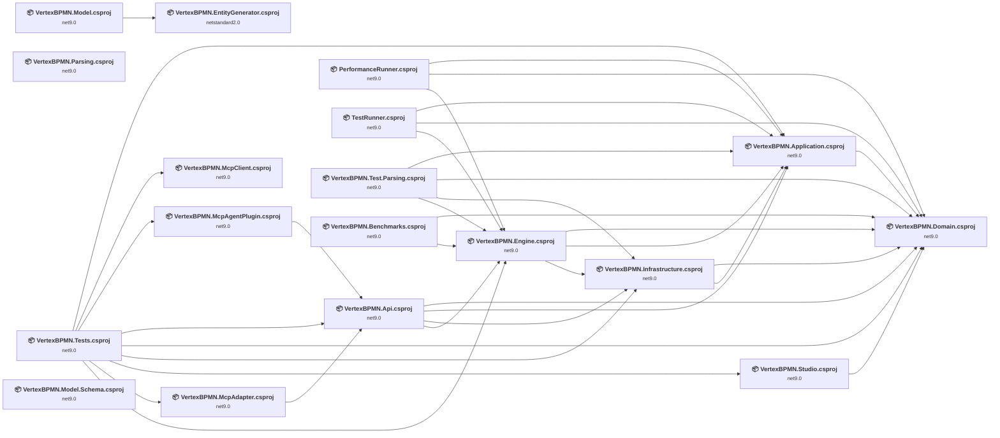

## Project Details

### benchmarks\VertexBPMN.Benchmarks\VertexBPMN.Benchmarks.csproj

#### Project Info

- **Current Target Framework:** net9.0
- **Proposed Target Framework:** net10.0
- **SDK-style**: True
- **Project Kind:** DotNetCoreApp
- **Dependencies**: 2
- **Dependants**: 0
- **Number of Files**: 4
- **Number of Files with Incidents**: 1
- **Lines of Code**: 654
- **Estimated LOC to modify**: 0+ (at least 0,0% of the project)

#### Dependency Graph

Legend:
📦 SDK-style project
⚙️ Classic project

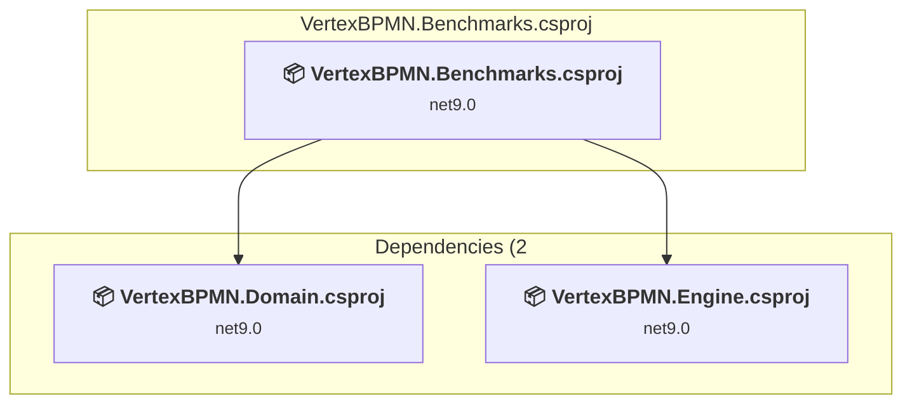

### API Compatibility

| Category | Count | Impact |
| :--- | :---: | :--- |
| 🔴 Binary Incompatible | 0 | High - Require code changes |
| 🟡 Source Incompatible | 0 | Medium - Needs re-compilation and potential conflicting API error fixing |
| 🔵 Behavioral change | 0 | Low - Behavioral changes that may require testing at runtime |
| ✅ Compatible | 262 |  |
| ***Total APIs Analyzed*** | ***262*** |  |

### src\VertexBPMN.Api\VertexBPMN.Api.csproj

#### Project Info

- **Current Target Framework:** net9.0
- **Proposed Target Framework:** net10.0
- **SDK-style**: True
- **Project Kind:** AspNetCore
- **Dependencies**: 4
- **Dependants**: 3
- **Number of Files**: 124
- **Number of Files with Incidents**: 14
- **Lines of Code**: 8740
- **Estimated LOC to modify**: 65+ (at least 0,7% of the project)

#### Dependency Graph

Legend:
📦 SDK-style project
⚙️ Classic project

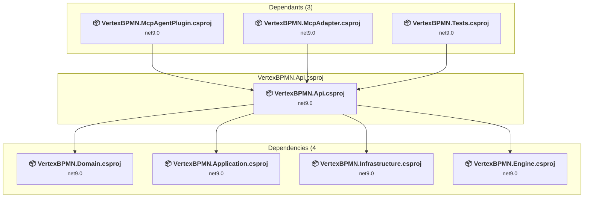

### API Compatibility

| Category | Count | Impact |
| :--- | :---: | :--- |
| 🔴 Binary Incompatible | 3 | High - Require code changes |
| 🟡 Source Incompatible | 60 | Medium - Needs re-compilation and potential conflicting API error fixing |
| 🔵 Behavioral change | 2 | Low - Behavioral changes that may require testing at runtime |
| ✅ Compatible | 13383 |  |
| ***Total APIs Analyzed*** | ***13448*** |  |

### src\VertexBPMN.Application\VertexBPMN.Application.csproj

#### Project Info

- **Current Target Framework:** net9.0
- **Proposed Target Framework:** net10.0
- **SDK-style**: True
- **Project Kind:** ClassLibrary
- **Dependencies**: 1
- **Dependants**: 7
- **Number of Files**: 46
- **Number of Files with Incidents**: 15
- **Lines of Code**: 5654
- **Estimated LOC to modify**: 49+ (at least 0,9% of the project)

#### Dependency Graph

Legend:
📦 SDK-style project
⚙️ Classic project

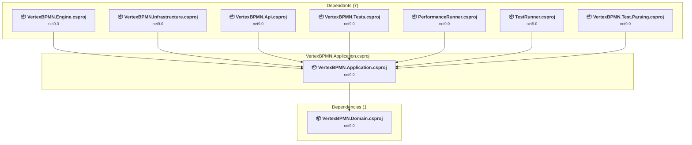

### API Compatibility

| Category | Count | Impact |
| :--- | :---: | :--- |
| 🔴 Binary Incompatible | 2 | High - Require code changes |
| 🟡 Source Incompatible | 16 | Medium - Needs re-compilation and potential conflicting API error fixing |
| 🔵 Behavioral change | 31 | Low - Behavioral changes that may require testing at runtime |
| ✅ Compatible | 6678 |  |
| ***Total APIs Analyzed*** | ***6727*** |  |

### src\VertexBPMN.Domain\VertexBPMN.Domain.csproj

#### Project Info

- **Current Target Framework:** net9.0
- **Proposed Target Framework:** net10.0
- **SDK-style**: True
- **Project Kind:** ClassLibrary
- **Dependencies**: 0
- **Dependants**: 10
- **Number of Files**: 219
- **Number of Files with Incidents**: 2
- **Lines of Code**: 4870
- **Estimated LOC to modify**: 1+ (at least 0,0% of the project)

#### Dependency Graph

Legend:
📦 SDK-style project
⚙️ Classic project

```mermaid
flowchart TB
    subgraph upstream["Dependants (10)"]
        P2["<b>📦&nbsp;VertexBPMN.Application.csproj</b><br/><small>net9.0</small>"]
        P3["<b>📦&nbsp;VertexBPMN.Engine.csproj</b><br/><small>net9.0</small>"]
        P4["<b>📦&nbsp;VertexBPMN.Infrastructure.csproj</b><br/><small>net9.0</small>"]
        P6["<b>📦&nbsp;VertexBPMN.Api.csproj</b><br/><small>net9.0</small>"]
        P9["<b>📦&nbsp;VertexBPMN.Tests.csproj</b><br/><small>net9.0</small>"]
        P10["<b>📦&nbsp;VertexBPMN.Studio.csproj</b><br/><small>net9.0</small>"]
        P11["<b>📦&nbsp;PerformanceRunner.csproj</b><br/><small>net9.0</small>"]
        P12["<b>📦&nbsp;TestRunner.csproj</b><br/><small>net9.0</small>"]
        P14["<b>📦&nbsp;VertexBPMN.Test.Parsing.csproj</b><br/><small>net9.0</small>"]
        P15["<b>📦&nbsp;VertexBPMN.Benchmarks.csproj</b><br/><small>net9.0</small>"]
        click P2 "#srcvertexbpmnapplicationvertexbpmnapplicationcsproj"
        click P3 "#srcvertexbpmnenginevertexbpmnenginecsproj"
        click P4 "#srcvertexbpmninfrastructurevertexbpmninfrastructurecsproj"
        click P6 "#srcvertexbpmnapivertexbpmnapicsproj"
        click P9 "#testsvertexbpmntestsvertexbpmntestscsproj"
        click P10 "#srcvertexbpmnstudiovertexbpmnstudiocsproj"
        click P11 "#testsperformancerunnerperformancerunnercsproj"
        click P12 "#teststestrunnertestrunnercsproj"
        click P14 "#testsvertexbpmntestparsingvertexbpmntestparsingcsproj"
        click P15 "#benchmarksvertexbpmnbenchmarksvertexbpmnbenchmarkscsproj"
    end
    subgraph current["VertexBPMN.Domain.csproj"]
        MAIN["<b>📦&nbsp;VertexBPMN.Domain.csproj</b><br/><small>net9.0</small>"]
        click MAIN "#srcvertexbpmndomainvertexbpmndomaincsproj"
    end
    P2 --> MAIN
    P3 --> MAIN
    P4 --> MAIN
    P6 --> MAIN
    P9 --> MAIN
    P10 --> MAIN
    P11 --> MAIN
    P12 --> MAIN
    P14 --> MAIN
    P15 --> MAIN

```

### API Compatibility

| Category | Count | Impact |
| :--- | :---: | :--- |
| 🔴 Binary Incompatible | 0 | High - Require code changes |
| 🟡 Source Incompatible | 1 | Medium - Needs re-compilation and potential conflicting API error fixing |
| 🔵 Behavioral change | 0 | Low - Behavioral changes that may require testing at runtime |
| ✅ Compatible | 9204 |  |
| ***Total APIs Analyzed*** | ***9205*** |  |

### src\VertexBPMN.Engine\VertexBPMN.Engine.csproj

#### Project Info

- **Current Target Framework:** net9.0
- **Proposed Target Framework:** net10.0
- **SDK-style**: True
- **Project Kind:** ClassLibrary
- **Dependencies**: 3
- **Dependants**: 6
- **Number of Files**: 28
- **Number of Files with Incidents**: 6
- **Lines of Code**: 14222
- **Estimated LOC to modify**: 26+ (at least 0,2% of the project)

#### Dependency Graph

Legend:
📦 SDK-style project
⚙️ Classic project

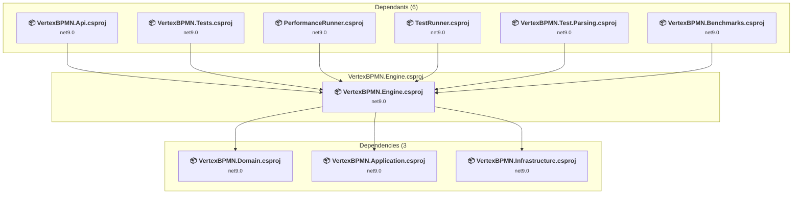

### API Compatibility

| Category | Count | Impact |
| :--- | :---: | :--- |
| 🔴 Binary Incompatible | 0 | High - Require code changes |
| 🟡 Source Incompatible | 17 | Medium - Needs re-compilation and potential conflicting API error fixing |
| 🔵 Behavioral change | 9 | Low - Behavioral changes that may require testing at runtime |
| ✅ Compatible | 20139 |  |
| ***Total APIs Analyzed*** | ***20165*** |  |

### src\VertexBPMN.Infrastructure\VertexBPMN.Infrastructure.csproj

#### Project Info

- **Current Target Framework:** net9.0
- **Proposed Target Framework:** net10.0
- **SDK-style**: True
- **Project Kind:** ClassLibrary
- **Dependencies**: 2
- **Dependants**: 4
- **Number of Files**: 45
- **Number of Files with Incidents**: 4
- **Lines of Code**: 3234
- **Estimated LOC to modify**: 3+ (at least 0,1% of the project)

#### Dependency Graph

Legend:
📦 SDK-style project
⚙️ Classic project

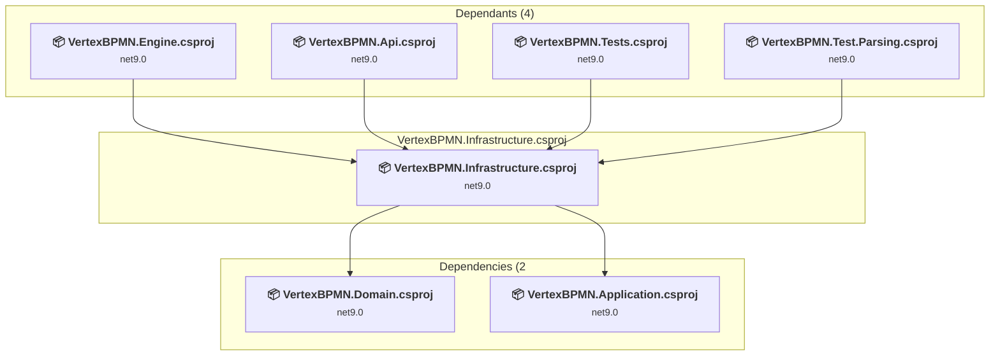

### API Compatibility

| Category | Count | Impact |
| :--- | :---: | :--- |
| 🔴 Binary Incompatible | 2 | High - Require code changes |
| 🟡 Source Incompatible | 1 | Medium - Needs re-compilation and potential conflicting API error fixing |
| 🔵 Behavioral change | 0 | Low - Behavioral changes that may require testing at runtime |
| ✅ Compatible | 4559 |  |
| ***Total APIs Analyzed*** | ***4562*** |  |

### src\VertexBPMN.Integration\McpAdapter\VertexBPMN.McpAdapter.csproj

#### Project Info

- **Current Target Framework:** net9.0
- **Proposed Target Framework:** net10.0
- **SDK-style**: True
- **Project Kind:** AspNetCore
- **Dependencies**: 1
- **Dependants**: 1
- **Number of Files**: 4
- **Number of Files with Incidents**: 4
- **Lines of Code**: 439
- **Estimated LOC to modify**: 7+ (at least 1,6% of the project)

#### Dependency Graph

Legend:
📦 SDK-style project
⚙️ Classic project

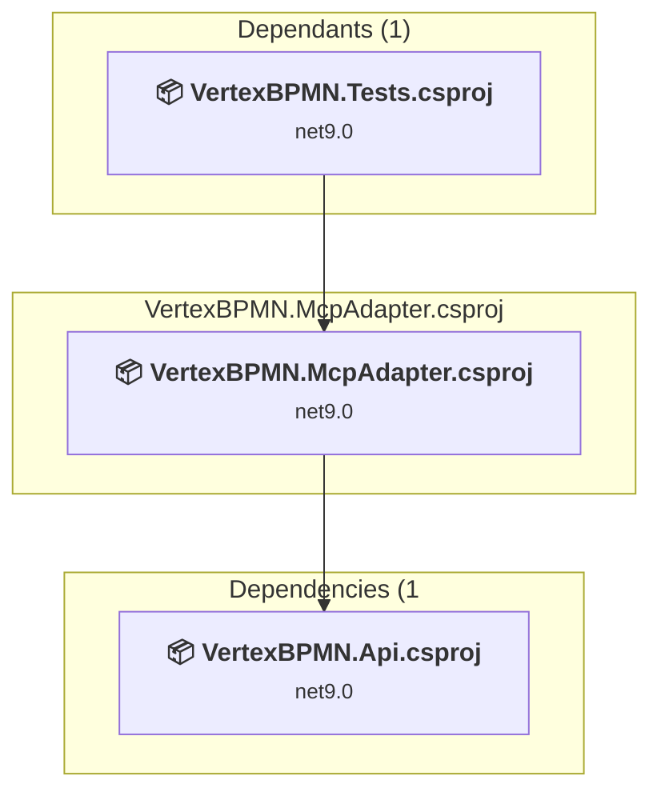

### API Compatibility

| Category | Count | Impact |
| :--- | :---: | :--- |
| 🔴 Binary Incompatible | 3 | High - Require code changes |
| 🟡 Source Incompatible | 0 | Medium - Needs re-compilation and potential conflicting API error fixing |
| 🔵 Behavioral change | 4 | Low - Behavioral changes that may require testing at runtime |
| ✅ Compatible | 635 |  |
| ***Total APIs Analyzed*** | ***642*** |  |

#### Project Technologies and Features

| Technology | Issues | Percentage | Migration Path |
| :--- | :---: | :---: | :--- |
| IdentityModel & Claims-based Security | 3 | 42,9% | Windows Identity Foundation (WIF), SAML, and claims-based authentication APIs that have been replaced by modern identity libraries. WIF was the original identity framework for .NET Framework. Migrate to Microsoft.IdentityModel.* packages (modern identity stack). |

### src\VertexBPMN.Integration\McpAgentPlugin\VertexBPMN.McpAgentPlugin.csproj

#### Project Info

- **Current Target Framework:** net9.0
- **Proposed Target Framework:** net10.0
- **SDK-style**: True
- **Project Kind:** ClassLibrary
- **Dependencies**: 1
- **Dependants**: 1
- **Number of Files**: 1
- **Number of Files with Incidents**: 2
- **Lines of Code**: 161
- **Estimated LOC to modify**: 1+ (at least 0,6% of the project)

#### Dependency Graph

Legend:
📦 SDK-style project
⚙️ Classic project

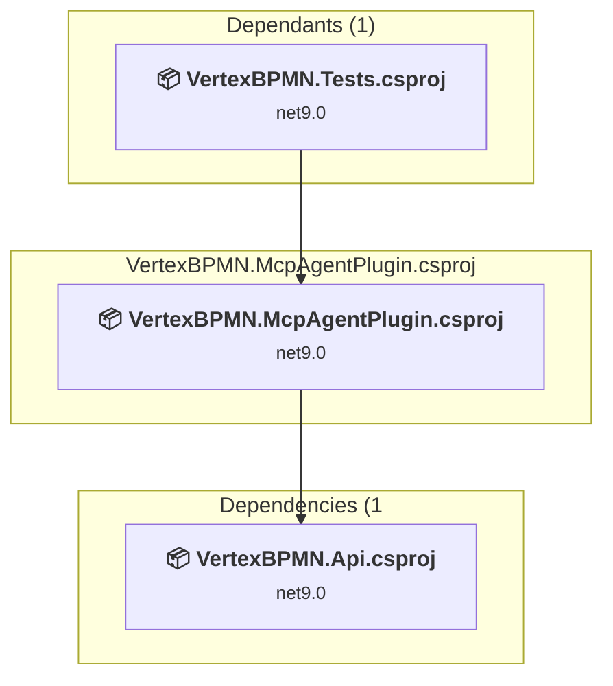

### API Compatibility

| Category | Count | Impact |
| :--- | :---: | :--- |
| 🔴 Binary Incompatible | 0 | High - Require code changes |
| 🟡 Source Incompatible | 0 | Medium - Needs re-compilation and potential conflicting API error fixing |
| 🔵 Behavioral change | 1 | Low - Behavioral changes that may require testing at runtime |
| ✅ Compatible | 198 |  |
| ***Total APIs Analyzed*** | ***199*** |  |

### src\VertexBPMN.Integration\McpClient\VertexBPMN.McpClient.csproj

#### Project Info

- **Current Target Framework:** net9.0
- **Proposed Target Framework:** net10.0
- **SDK-style**: True
- **Project Kind:** ClassLibrary
- **Dependencies**: 0
- **Dependants**: 1
- **Number of Files**: 1
- **Number of Files with Incidents**: 2
- **Lines of Code**: 67
- **Estimated LOC to modify**: 8+ (at least 11,9% of the project)

#### Dependency Graph

Legend:
📦 SDK-style project
⚙️ Classic project

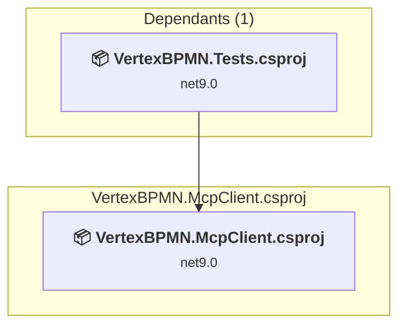

### API Compatibility

| Category | Count | Impact |
| :--- | :---: | :--- |
| 🔴 Binary Incompatible | 0 | High - Require code changes |
| 🟡 Source Incompatible | 0 | Medium - Needs re-compilation and potential conflicting API error fixing |
| 🔵 Behavioral change | 8 | Low - Behavioral changes that may require testing at runtime |
| ✅ Compatible | 135 |  |
| ***Total APIs Analyzed*** | ***143*** |  |

### src\VertexBPMN.Model.Schema\VertexBPMN.Model.Schema.csproj

#### Project Info

- **Current Target Framework:** net9.0
- **Proposed Target Framework:** net10.0
- **SDK-style**: True
- **Project Kind:** DotNetCoreApp
- **Dependencies**: 0
- **Dependants**: 0
- **Number of Files**: 183
- **Number of Files with Incidents**: 2
- **Lines of Code**: 36615
- **Estimated LOC to modify**: 6+ (at least 0,0% of the project)

#### Dependency Graph

Legend:
📦 SDK-style project
⚙️ Classic project

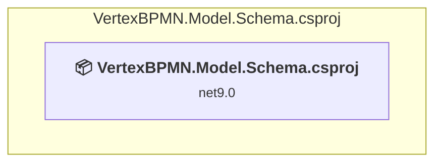

### API Compatibility

| Category | Count | Impact |
| :--- | :---: | :--- |
| 🔴 Binary Incompatible | 0 | High - Require code changes |
| 🟡 Source Incompatible | 0 | Medium - Needs re-compilation and potential conflicting API error fixing |
| 🔵 Behavioral change | 6 | Low - Behavioral changes that may require testing at runtime |
| ✅ Compatible | 35086 |  |
| ***Total APIs Analyzed*** | ***35092*** |  |

### src\VertexBPMN.Model\VertexBPMN.Model.csproj

#### Project Info

- **Current Target Framework:** net9.0
- **Proposed Target Framework:** net10.0
- **SDK-style**: True
- **Project Kind:** ClassLibrary
- **Dependencies**: 1
- **Dependants**: 0
- **Number of Files**: 67
- **Number of Files with Incidents**: 2
- **Lines of Code**: 18976
- **Estimated LOC to modify**: 7+ (at least 0,0% of the project)

#### Dependency Graph

Legend:
📦 SDK-style project
⚙️ Classic project

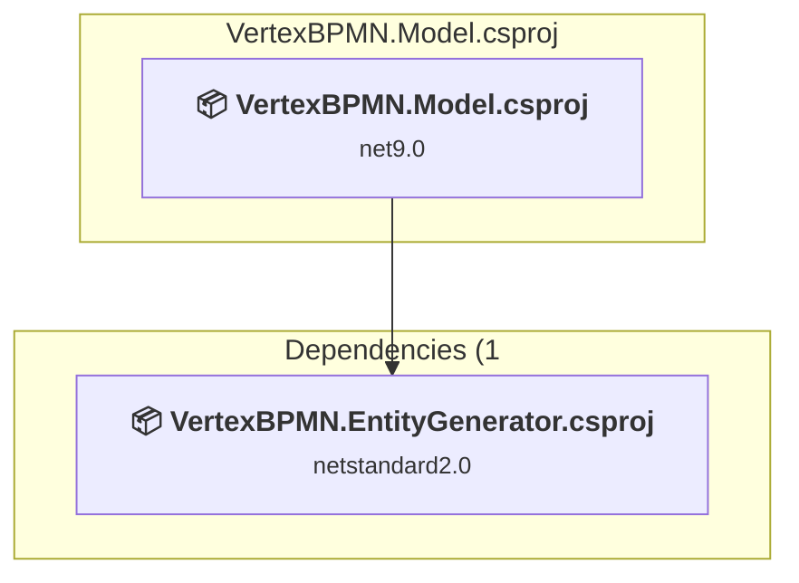

### API Compatibility

| Category | Count | Impact |
| :--- | :---: | :--- |
| 🔴 Binary Incompatible | 0 | High - Require code changes |
| 🟡 Source Incompatible | 0 | Medium - Needs re-compilation and potential conflicting API error fixing |
| 🔵 Behavioral change | 7 | Low - Behavioral changes that may require testing at runtime |
| ✅ Compatible | 44388 |  |
| ***Total APIs Analyzed*** | ***44395*** |  |

### src\VertexBPMN.Parsing\VertexBPMN.Parsing.csproj

#### Project Info

- **Current Target Framework:** net9.0
- **Proposed Target Framework:** net10.0
- **SDK-style**: True
- **Project Kind:** ClassLibrary
- **Dependencies**: 0
- **Dependants**: 0
- **Number of Files**: 65
- **Number of Files with Incidents**: 4
- **Lines of Code**: 11619
- **Estimated LOC to modify**: 9+ (at least 0,1% of the project)

#### Dependency Graph

Legend:
📦 SDK-style project
⚙️ Classic project

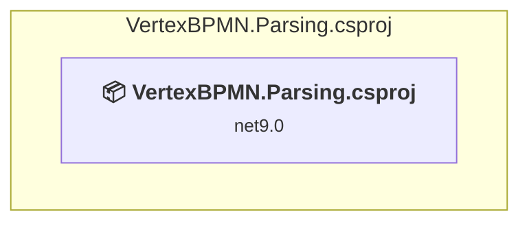

### API Compatibility

| Category | Count | Impact |
| :--- | :---: | :--- |
| 🔴 Binary Incompatible | 0 | High - Require code changes |
| 🟡 Source Incompatible | 1 | Medium - Needs re-compilation and potential conflicting API error fixing |
| 🔵 Behavioral change | 8 | Low - Behavioral changes that may require testing at runtime |
| ✅ Compatible | 18830 |  |
| ***Total APIs Analyzed*** | ***18839*** |  |

### src\VertexBPMN.Studio\VertexBPMN.Studio.csproj

#### Project Info

- **Current Target Framework:** net9.0
- **Proposed Target Framework:** net10.0
- **SDK-style**: True
- **Project Kind:** AspNetCore
- **Dependencies**: 1
- **Dependants**: 1
- **Number of Files**: 65
- **Number of Files with Incidents**: 6
- **Lines of Code**: 813
- **Estimated LOC to modify**: 13+ (at least 1,6% of the project)

#### Dependency Graph

Legend:
📦 SDK-style project
⚙️ Classic project

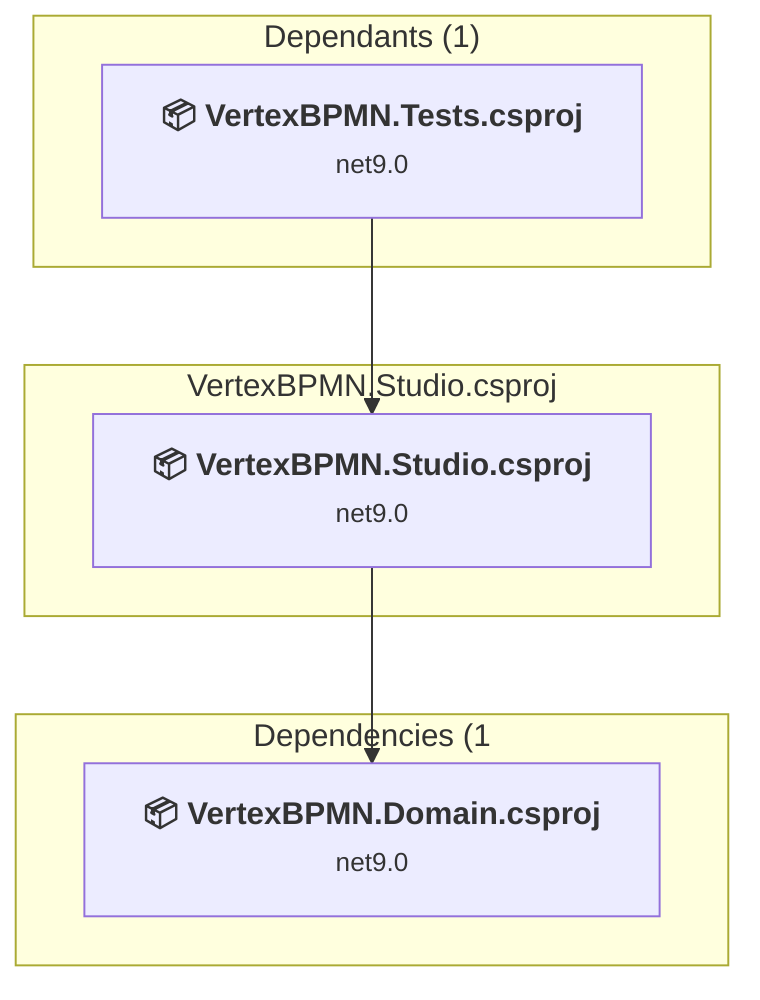

### API Compatibility

| Category | Count | Impact |
| :--- | :---: | :--- |
| 🔴 Binary Incompatible | 0 | High - Require code changes |
| 🟡 Source Incompatible | 6 | Medium - Needs re-compilation and potential conflicting API error fixing |
| 🔵 Behavioral change | 7 | Low - Behavioral changes that may require testing at runtime |
| ✅ Compatible | 14524 |  |
| ***Total APIs Analyzed*** | ***14537*** |  |

### tests\PerformanceRunner\PerformanceRunner.csproj

#### Project Info

- **Current Target Framework:** net9.0
- **Proposed Target Framework:** net10.0
- **SDK-style**: True
- **Project Kind:** DotNetCoreApp
- **Dependencies**: 3
- **Dependants**: 0
- **Number of Files**: 9
- **Number of Files with Incidents**: 1
- **Lines of Code**: 488
- **Estimated LOC to modify**: 0+ (at least 0,0% of the project)

#### Dependency Graph

Legend:
📦 SDK-style project
⚙️ Classic project

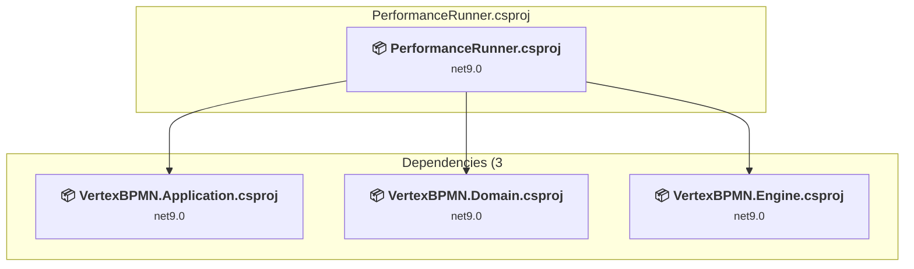

### API Compatibility

| Category | Count | Impact |
| :--- | :---: | :--- |
| 🔴 Binary Incompatible | 0 | High - Require code changes |
| 🟡 Source Incompatible | 0 | Medium - Needs re-compilation and potential conflicting API error fixing |
| 🔵 Behavioral change | 0 | Low - Behavioral changes that may require testing at runtime |
| ✅ Compatible | 679 |  |
| ***Total APIs Analyzed*** | ***679*** |  |

### tests\TestRunner\TestRunner.csproj

#### Project Info

- **Current Target Framework:** net9.0
- **Proposed Target Framework:** net10.0
- **SDK-style**: True
- **Project Kind:** DotNetCoreApp
- **Dependencies**: 3
- **Dependants**: 0
- **Number of Files**: 1
- **Number of Files with Incidents**: 1
- **Lines of Code**: 265
- **Estimated LOC to modify**: 0+ (at least 0,0% of the project)

#### Dependency Graph

Legend:
📦 SDK-style project
⚙️ Classic project

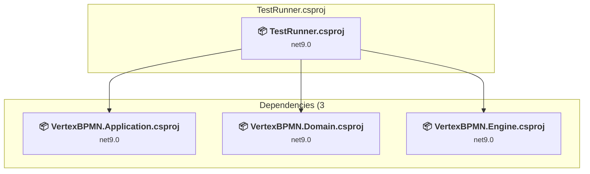

### API Compatibility

| Category | Count | Impact |
| :--- | :---: | :--- |
| 🔴 Binary Incompatible | 0 | High - Require code changes |
| 🟡 Source Incompatible | 0 | Medium - Needs re-compilation and potential conflicting API error fixing |
| 🔵 Behavioral change | 0 | Low - Behavioral changes that may require testing at runtime |
| ✅ Compatible | 342 |  |
| ***Total APIs Analyzed*** | ***342*** |  |

### tests\VertexBPMN.Test.Parsing\VertexBPMN.Test.Parsing.csproj

#### Project Info

- **Current Target Framework:** net9.0
- **Proposed Target Framework:** net10.0
- **SDK-style**: True
- **Project Kind:** DotNetCoreApp
- **Dependencies**: 4
- **Dependants**: 0
- **Number of Files**: 209
- **Number of Files with Incidents**: 4
- **Lines of Code**: 8166
- **Estimated LOC to modify**: 6+ (at least 0,1% of the project)

#### Dependency Graph

Legend:
📦 SDK-style project
⚙️ Classic project

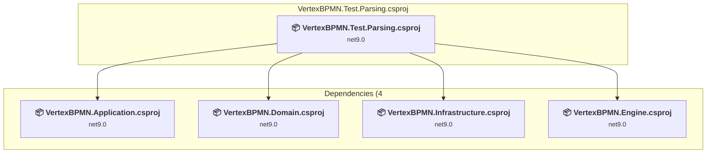

### API Compatibility

| Category | Count | Impact |
| :--- | :---: | :--- |
| 🔴 Binary Incompatible | 0 | High - Require code changes |
| 🟡 Source Incompatible | 6 | Medium - Needs re-compilation and potential conflicting API error fixing |
| 🔵 Behavioral change | 0 | Low - Behavioral changes that may require testing at runtime |
| ✅ Compatible | 7380 |  |
| ***Total APIs Analyzed*** | ***7386*** |  |

### tests\VertexBPMN.Tests\VertexBPMN.Tests.csproj

#### Project Info

- **Current Target Framework:** net9.0
- **Proposed Target Framework:** net10.0
- **SDK-style**: True
- **Project Kind:** DotNetCoreApp
- **Dependencies**: 9
- **Dependants**: 0
- **Number of Files**: 130
- **Number of Files with Incidents**: 18
- **Lines of Code**: 8384
- **Estimated LOC to modify**: 80+ (at least 1,0% of the project)

#### Dependency Graph

Legend:
📦 SDK-style project
⚙️ Classic project

```mermaid
flowchart TB
    subgraph current["VertexBPMN.Tests.csproj"]
        MAIN["<b>📦&nbsp;VertexBPMN.Tests.csproj</b><br/><small>net9.0</small>"]
        click MAIN "#testsvertexbpmntestsvertexbpmntestscsproj"
    end
    subgraph downstream["Dependencies (9"]
        P2["<b>📦&nbsp;VertexBPMN.Application.csproj</b><br/><small>net9.0</small>"]
        P8["<b>📦&nbsp;VertexBPMN.McpClient.csproj</b><br/><small>net9.0</small>"]
        P5["<b>📦&nbsp;VertexBPMN.McpAgentPlugin.csproj</b><br/><small>net9.0</small>"]
        P6["<b>📦&nbsp;VertexBPMN.Api.csproj</b><br/><small>net9.0</small>"]
        P1["<b>📦&nbsp;VertexBPMN.Domain.csproj</b><br/><small>net9.0</small>"]
        P4["<b>📦&nbsp;VertexBPMN.Infrastructure.csproj</b><br/><small>net9.0</small>"]
        P10["<b>📦&nbsp;VertexBPMN.Studio.csproj</b><br/><small>net9.0</small>"]
        P7["<b>📦&nbsp;VertexBPMN.McpAdapter.csproj</b><br/><small>net9.0</small>"]
        P3["<b>📦&nbsp;VertexBPMN.Engine.csproj</b><br/><small>net9.0</small>"]
        click P2 "#srcvertexbpmnapplicationvertexbpmnapplicationcsproj"
        click P8 "#srcvertexbpmnintegrationmcpclientvertexbpmnmcpclientcsproj"
        click P5 "#srcvertexbpmnintegrationmcpagentpluginvertexbpmnmcpagentplugincsproj"
        click P6 "#srcvertexbpmnapivertexbpmnapicsproj"
        click P1 "#srcvertexbpmndomainvertexbpmndomaincsproj"
        click P4 "#srcvertexbpmninfrastructurevertexbpmninfrastructurecsproj"
        click P10 "#srcvertexbpmnstudiovertexbpmnstudiocsproj"
        click P7 "#srcvertexbpmnintegrationmcpadaptervertexbpmnmcpadaptercsproj"
        click P3 "#srcvertexbpmnenginevertexbpmnenginecsproj"
    end
    MAIN --> P2
    MAIN --> P8
    MAIN --> P5
    MAIN --> P6
    MAIN --> P1
    MAIN --> P4
    MAIN --> P10
    MAIN --> P7
    MAIN --> P3

```

### API Compatibility

| Category | Count | Impact |
| :--- | :---: | :--- |
| 🔴 Binary Incompatible | 0 | High - Require code changes |
| 🟡 Source Incompatible | 6 | Medium - Needs re-compilation and potential conflicting API error fixing |
| 🔵 Behavioral change | 74 | Low - Behavioral changes that may require testing at runtime |
| ✅ Compatible | 10671 |  |
| ***Total APIs Analyzed*** | ***10751*** |  |

### utils\VertexBPMN.EntityGenerator\VertexBPMN.EntityGenerator.csproj

#### Project Info

- **Current Target Framework:** netstandard2.0✅
- **SDK-style**: True
- **Project Kind:** ClassLibrary
- **Dependencies**: 0
- **Dependants**: 1
- **Number of Files**: 2
- **Number of Files with Incidents**: 1
- **Lines of Code**: 647
- **Estimated LOC to modify**: 0+ (at least 0,0% of the project)

#### Dependency Graph

Legend:
📦 SDK-style project
⚙️ Classic project

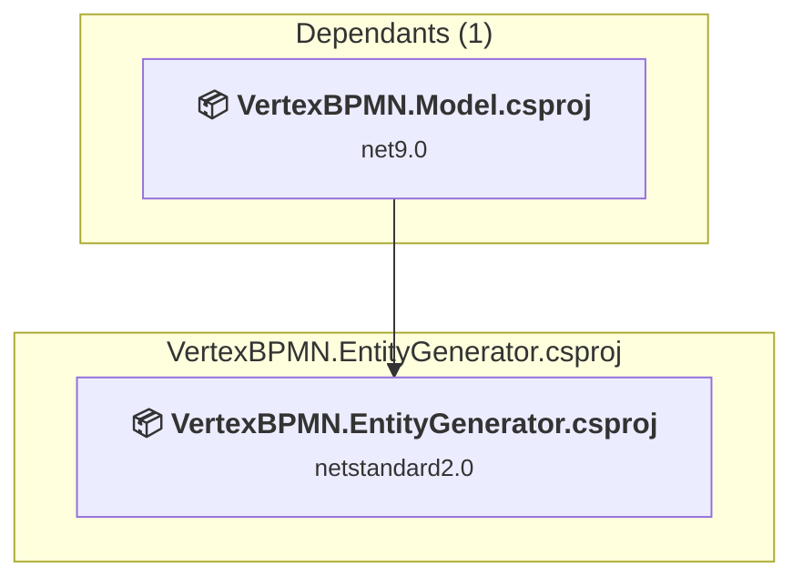

### API Compatibility

| Category | Count | Impact |
| :--- | :---: | :--- |
| 🔴 Binary Incompatible | 0 | High - Require code changes |
| 🟡 Source Incompatible | 0 | Medium - Needs re-compilation and potential conflicting API error fixing |
| 🔵 Behavioral change | 0 | Low - Behavioral changes that may require testing at runtime |
| ✅ Compatible | 476 |  |
| ***Total APIs Analyzed*** | ***476*** |  |

