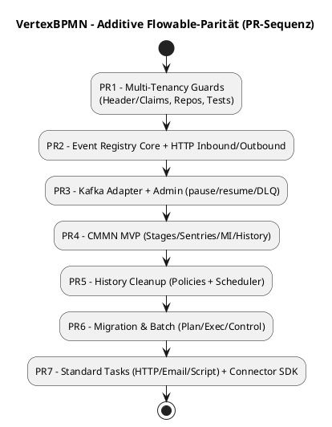

# AI Codegen Guide – VertexBPMN

> Dieses Dokument definiert **verbindliche Leitplanken** für KI-gestützte Code-Generierung in VertexBPMN. Ziel:
> (1) **Camunda-REST-Parität** unverändert erhalten,
> (2) **Flowable-OSS-Parität** **additiv** implementieren, ohne Bestehendes zu überschreiben,
> (3) Qualitäts-, Test- und Architekturkonventionen strikt einhalten.

---

## 1) Scope & Ziele

* **Bewahren:** Alle bestehenden **Camunda-kompatiblen** APIs, DTOs und Semantiken **dürfen nicht verändert** werden (nur additive Ergänzungen). Die Camunda-Paritätsmatrix ist maßgeblich.&#x20;
* **Erweitern:** Flowable-OSS-Parität wird **modular** ergänzt (CMMN, Event Registry, engine-weite Multi-Tenancy, History-Cleanup, Migration/Batch, Standard-Tasks). **Eigene API-Räume**, keine Überschreibung bestehender Routen.
* **Konformität:** TDD, Konformität zu MIWG/DMN-TCK, OpenAPI-First, Observability by default.

---

## 2) Nicht verhandelbare Projektkonventionen (bitte strikt)

* **Tech/Architektur:** .NET 9/C# 13; **Repository/UoW**; **kein** direkter `DbContext` in Business-Logik; Minimal APIs (REST), gRPC optional; OpenTelemetry; PostgreSQL primär.
* **TDD & Conformance:** RED→GREEN→REFACTOR; Contract/Integration/E2E vor Implementierung; MIWG & DMN-TCK müssen bestehen.
* **Ziele/Entities/Anforderungen:** Multi-Tenancy, RBAC, Versionierung, Audit/History u. a. sind funktionale Muss-Kriterien.

> **Check:** Vor jeder Generierung die **Phasen-/Ordnerstruktur** aus `plan.md` respektieren (`specs/[feature]/plan|research|data-model|contracts|quickstart`). **/plan** erzeugt Spez-Artefakte; **/tasks** plant Umsetzung. **Keine** Implementierung vor failenden Tests.

---

## 3) Bestehende Camunda-Parität bewahren

* **Do not touch:** *Alle* vorhandenen Controller/DTOs/Filter unter Camunda-kompatiblen Routen (z. B. `/process-definition`, `/process-instance`, `/task`, `/history/*`, `/deployment`, …). Fehlende Endpunkte laut **Paritätsmatrix** sind **additiv** zu ergänzen (z. B. `/message`, `/signal`, `/job`, `/incident`, `/variable`, `/filter`, `/decision-instance`).&#x20;
* **Contract-Stabilität:** Vorhandene OpenAPI/Antworten als **Golden-Master** einfrieren (Approval-Tests). Änderungen nur **additiv**.&#x20;

---

## 4) Flowable-OSS-Parität **additiv** (eigene Module & Routen)

**Neue Module/Namespaces (Beispiele):**

* `Vertex.Cmmn`, `Vertex.EventRegistry`, `Vertex.Tenancy`, `Vertex.HistoryCleanup`, `Vertex.MigrationBatch`, `Vertex.Connectors.Http|Email|Script`, `Vertex.Api.Cmmn|Events`.

**Neue API-Räume (keine Überschneidung mit Camunda-Routen):**

* **CMMN:** `/cmmn/**` – CaseDefinition/CaseInstance/PlanItem/History (UTC).
* **Event Registry:** `/events/**` – Channels, Event-Definitions, Subscriptions, Admin (`pause/resume`), DLQ.
* **Multi-Tenancy Aspekte:** `/ _tenant /ping` (nur Echo), ansonsten **Header/Claims** in allen APIs.
* **History-Cleanup:** `/history/policies`, `/history/executions/*` (Cleanup-Sicht, nicht Laufzeit-History).
* **Migration/Batch:** `/migrations/**` – Plans, Batches, Control (pause/resume/cancel).
* **Standard-Tasks (Connectoren):** `/connectors/**` – Templates, Invoke (HTTP/Email/Script).

> Alle Verträge werden OpenAPI-first in den jeweiligen **`specs/[###-feature]/contracts`** gepflegt; Tests schlagen erst rot, dann Implementierung.&#x20;

---

## 5) Multi-Tenancy (engine-weit) – Regeln für Codegen

* **Pflicht:** Jede Runtime/History-Operation ist **tenant-aware** (Header `X-Tenant-Id` oder Token-Claim). **Default-Deny** bei fehlendem Tenant (konfigurierbar). **Kein Cross-Tenant**-Zugriff. (FR-009)&#x20;
* **Datenbank:** `tenant_id` **additiv** in *allen neuen* Tabellen; bei Alt-Tabellen nur **additiv** (erst `DEFAULT 'default'` → backfill → `NOT NULL`); **keine** Drops/Renames.
* **Indizes:** zusammengesetzt (`tenant_id`, Schlüssel/Status/Zeiten).
* **Tests:** Negative Cross-Tenant-Tests obligatorisch (403/404).

---

## 6) Datenmigrationen & Schema-Evolutions-Policy

* **Additiv only:** Spalten/Indizes/Constraints **nur hinzufügen**; keine semantischen Änderungen an bestehenden Spalten (Defaults/Nullability/Datentyp).
* **Neue Domänen → neue Tabellen** mit Präfixen: `cmmn_*`, `evt_*`, `mig_*`, `hc_*`, `conn_*`.
* **Rollback-Pfad:** Jede Migration liefert Down-Script.
* **CI-Lint:** Pipeline bricht bei Drops/Renames bestehender Artefakte ab. (siehe Tasks/Plan-Prinzipien)&#x20;

---

## 7) CI-Schranken (damit kein Bestand überschrieben wird)

1. **OpenAPI-Diff (no-breaking)** gegen Golden-Master der Camunda-Routen. Nur additive Änderungen erlaubt.&#x20;
2. **Approval Tests** (Golden-Master) für Responses bestehender Routen.
3. **Migrations-Lint** (Schema-Diff): verbietet Drops/Renames in bestehenden Tabellen.
4. **Conformance-Gates:** MIWG/DMN-TCK müssen grün sein, sonst kein Merge.&#x20;
5. **Smoke-Regression:** Kritische BPMN-Flows (Start→UserTask→ServiceTask→Timer→End) laufen unverändert grün.

---

## 8) Generierungs-Workflow für KI-Agenten

**Immer in dieser Reihenfolge:**

1. **Lesen:** `specs/[feature]/plan.md`, `research.md`, `data-model.md`, `contracts/*`, `quickstart.md`. **Kein** Code ohne diese Inputs.&#x20;
2. **Contracts → Tests:** Erst **Contract-Tests** erzeugen (rot). **Dann** Implementierung. (TDD Pflicht)&#x20;
3. **Tenancy Guards:** Bei *jedem* neuen Endpoint Header/Claims berücksichtigen; Queries tenant-scoped. (FR-009)&#x20;
4. **Observability:** Traces/Metriken/Logs pro Modul mit eigenem Namensraum (z. B. `vertex_cmmn_*`).&#x20;
5. **Keine Änderungen** an Camunda-Routen/DTOs – fehlende Endpunkte **additiv** ergänzen gemäß Matrix.&#x20;

---

## 9) Kurzreferenz: Was **neu** hinzukommt (Flowable-Parität)

* **CMMN 1.1 Runtime & History:** Stages, Sentries (on/if), Repetition, Event/Timer Listener, Milestones; REST unter `/cmmn/**`.
* **Event Registry:** Channels (HTTP/Kafka/Rabbit/JMS), Event-Definitions, Subscriptions, Korrelation (Start/Boundary); Admin (pause/resume, DLQ); REST `/events/**`.
* **Engine-weite Multi-Tenancy:** Tenant-Scoping für Deployments/Defs/Instanzen/Jobs/History; Header `X-Tenant-Id`. (siehe FR-009)&#x20;
* **History-Cleanup:** Policies + Scheduler + Reports; REST `/history/policies`, `/history/executions/*`.
* **Migration/Batch:** Plans, Batches, Control; REST `/migrations/**`.
* **Standard-Tasks/Connectoren:** HTTP (Auth/Mapping/Retry/Redaction), Email (SMTP/Template), Script (Roslyn/Jint Sandbox); REST `/connectors/**`.

> Die Artefakte (Plan/Spec/Contracts/Data-Model) werden in `specs/[###-feature]/` gepflegt – siehe Projektstruktur/Phasen im Plan.&#x20;

---

## 10) Do & Don’t (Cheatsheet)

**Do**

* Neue Module/Controller **unter eigenen Routen** anlegen (siehe §4).
* Für jede neue Route zuerst **OpenAPI** + **Contract-Tests**.&#x20;
* **Tenant-Scoping** konsequent in Repositories/Queries/Handlern. (FR-009)&#x20;
* **Observability**: Traces + Metriken + strukturierte Logs, keine Secrets im Log.&#x20;

**Don’t**

* **Nie** bestehende Camunda-Routen/DTOs/Filter ändern. Ergänzen nur **additiv**.&#x20;
* **Keine** direkten `DbContext`-Zugriffe in Business-Logik.&#x20;
* **Keine** Implementierung vor roten Tests (Contract/Integration).&#x20;
* **Keine** Schema-Breaking-Migrations (Drops/Renames an Bestandsobjekten).&#x20;

---

## 11) Mini-Roadmap (Anhaltspunkt für PR-Reihenfolge)

---

## 12) Ablageort & Naming

* **Datei:** `docs/working/ai-codegen-guide.md` (dieses Dokument)
* **Feature-Spezifikationen:** `specs/[###-feature]/(plan|spec|data-model|contracts|quickstart).md` (bereits in euren Projektvorgaben verankert).&#x20;

---

### Quellen (interne Vorgaben)

* **AI Agent Coding Instructions / Projektkonventionen** (Architektur, EF/Repo, OTel, Async-only, Naming, Testing).
* **Camunda-REST-Paritätsmatrix** (Status je Endpoint; additive Ergänzung fehlender Routen).&#x20;
* **Plan/Tasks-Rahmen & Phasenmodell** (OpenAPI-first, TDD, Struktur/Ordner).
* **Funktionale Muss-Kriterien (u. a. Multi-Tenancy, RBAC, Audit/History)**.&#x20;

---

**Hinweis für Maintainer:** Lege bitte in der CI eine Pflichtprüfung an, die bestätigt, dass in PRs mit Änderungen an `src/**` gleichzeitig **Contract-Tests** in `tests/contract/**` aktualisiert wurden (Fail sonst). Das stellt sicher, dass KI-Codegeneratoren die **OpenAPI-First & TDD**-Regel nicht aushebeln.
